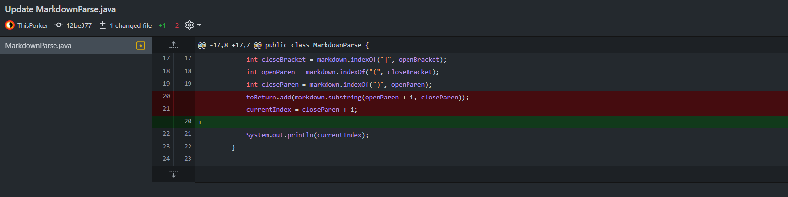
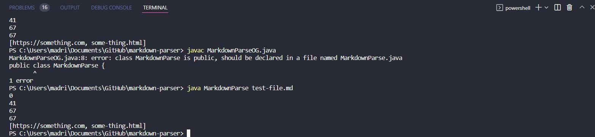
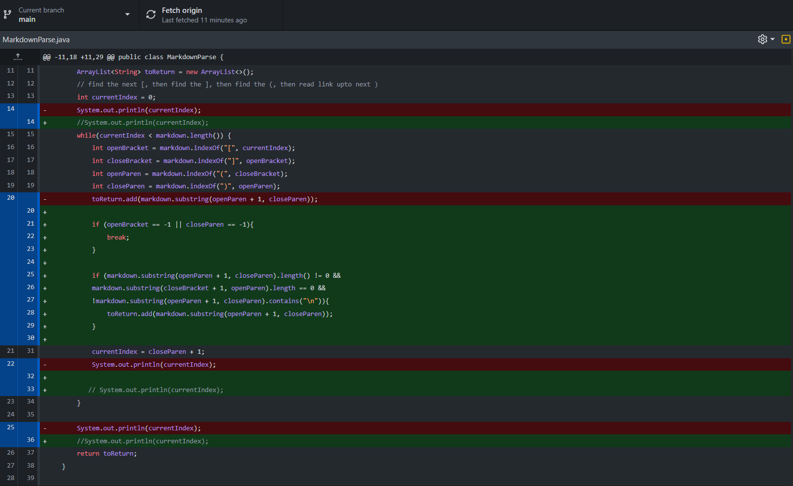
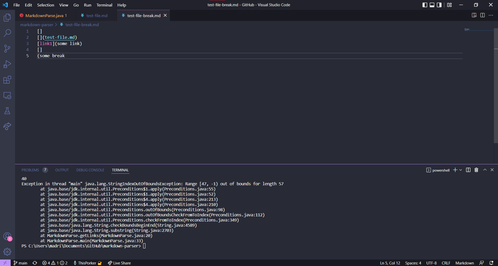
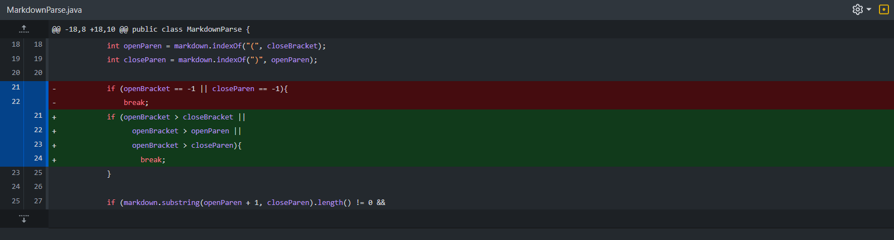
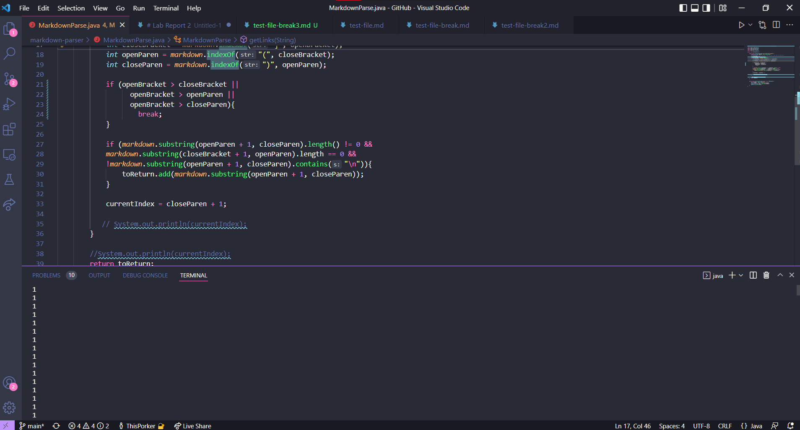

# Lab Report 2

**Week 3 Lab bug trials**

## First Code Change

I used the original [test-file.md](https://github.com/ThisPorker/markdown-parser/blob/main/test-file.md)

## First Code Change Result

This was a test to see how MarkdownParse worked. The removal of these two lines did not in fact break the code. I did however break the test file by adding "Hello World" to the last line, but I did not find a solution to that error.

## Second Code Change

The second iteration of MarkdownParse was made to test some if statements and re-adding original lines of code.

Modified test file: [test-file-break](https://github.com/ThisPorker/markdown-parser/blob/main/test-file-break.md)

## Second Code Change Result

The result from this test file caused an out of bounds error, return of a -1 value. The MarkdownParse version 2 didn't check for any lack of brackets or parenthesis.

## Third Change of Code

Testing more if statements.

Modified test file: [test-file-break3](https://github.com/ThisPorker/markdown-parser/blob/main/test-file-break3.md)

## Third Code Change Result

This one was one of the common bugs our groups found. Code lacked a check for closing brackets or parenthesis before opening ones. This resulted in an infinite loop in the terminal.