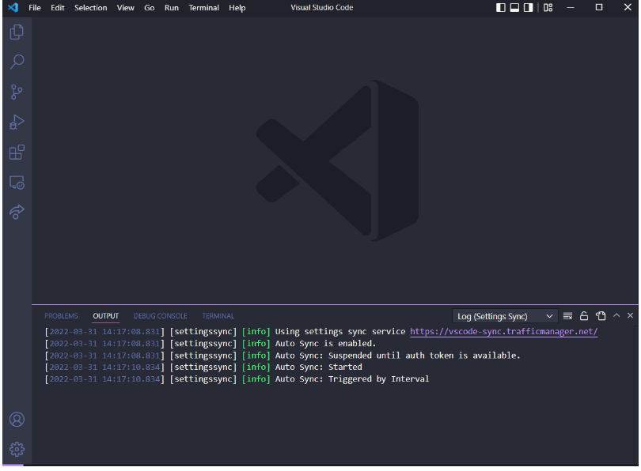
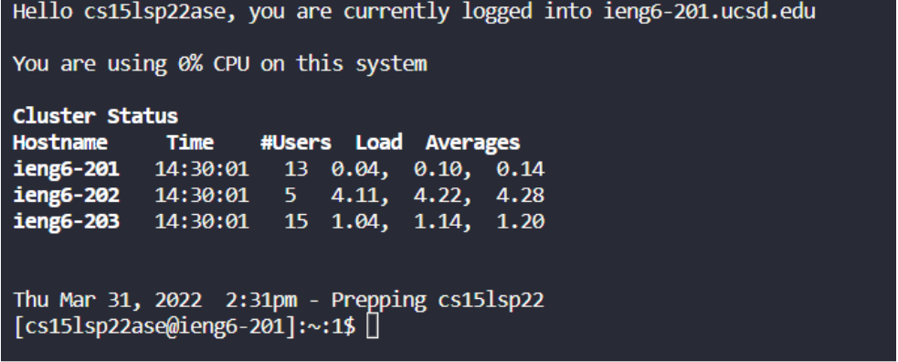
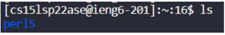
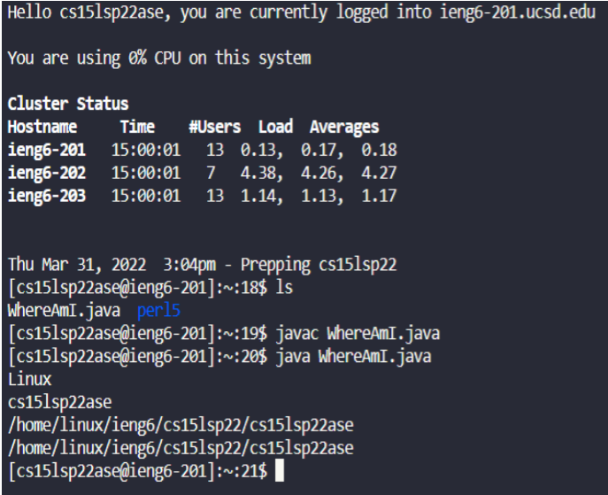
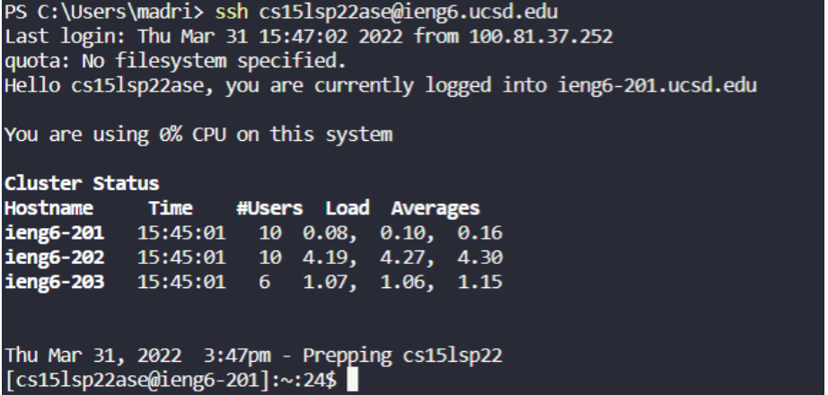
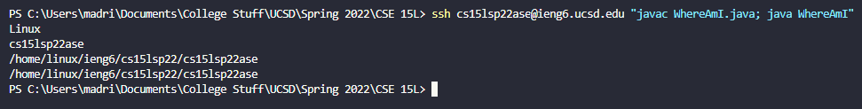

# Hello, this is Kris Madrigal from CSE 15L section B02. Welcome to Lab Report 1.

I will being going over the steps required to remote access the computers in the CSE building.

## Step 1: Download/Installing VScode
First, you are going to install VScode @ https://code.visualstudio.com/

After you are finished installing you should be able to open the program and should look similar to this. (My VScode might look a little different because of the theme I chose).

## Step 2: Remotely Connecting
Now that we have VScode up and running we are going to make sure OpenSSH is installed on your computer. Steps for this on can be found [here](https://docs.microsoft.com/en-us/windows-server/administration/openssh/openssh_install_firstuse).

After, we need to find your course specific account [here](https://sdacs.ucsd.edu/~icc/index.php). Once you have your info we will be ready to connect.

In VScode you are going type in this command into the terminal. **$ ssh cs15lsp22zz@ieng6.ucsd.edu** but **make sure you replace the "zz" in the command line with your specific acount letters**. Your first time connecting, you are going to watch to follow the prompts and then use your school account password to login. **(Note: You will need to do this for most of the commands involving your school user account in this guide)** Upon logging in you should see something like this.

## Step 3: Testing Out Commands
Let's experiment with a couple command lines in the computer we SSH'd into. There are a couple commands we could run like cd, pwd, mkdir, cp, and others. I chose to run ls. A simple command that shows availabe directories.

## Step 4: Moving Files with SCP
Here we are going to move files from out local machine to our remote connected computer. Using the scp command, **scp WhereAmI.java cs15lsp22zz@ieng6.ucsd.edu:~/**, I moved my WhereAmI.java to my remote connection. Then I ran the java file to compare the output from my local machine to the remote connection.

## Step 5: Setting an SSH Key
In order to avoid repeating the task of having to sign in everytime we want to do something on the remote connection we are going to create an ssh key to store a pair of files in place of your password. On the local machine you want to run the command, $ ssh-keygen. 

AVOID adding a passphrase when asked, just continue to hit Enter throughout the process of creating your ssh key. (Extra step for Windows users: [Link](https://docs.microsoft.com/en-us/windows-server/administration/openssh/openssh_keymanagement#user-key-generation))

Now we login to the remote connection manually to copy the public key to the .ssh directory of our user account.After login, use the command **mkdir .ssh**. Logout and use the command **scp /Users/<user-name>/.ssh/id_rsa.pub
cs15lsp22zz@ieng6.ucsd.edu:~/.ssh/authorized_keys**.
  

  
## Step 6: Optimize Remote Running
Here we can use a combination of everything together. I am going to compile and run the WhereAmI.java on the remote connection in one line. This should utilize the ssh key we generated to access the remote connection without logging in. This will show a quick output ran from the remote connection.

