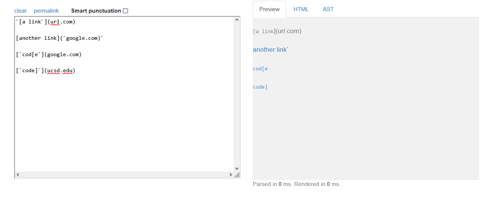
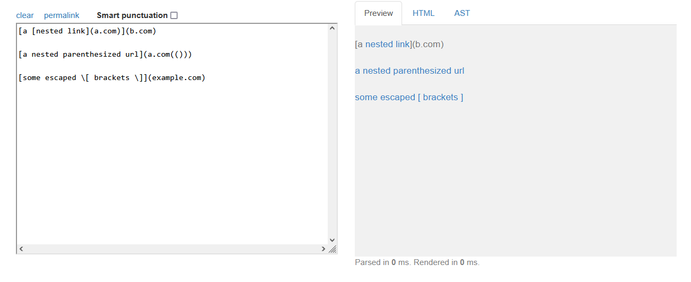

# Lab Report 4 - Week 8

## Markdown-parse repositories being reviewed

[My markdown-parse](https://github.com/ThisPorker/good-markdown-parser)

[Other group markdown-parse](https://github.com/UDXS/markdown-parser)

## Expected Output via CommonMark

### Snippet 1

Expected output is `"google.com", "google.com", "ucsd.edu"`
### Snippet 2

Expected Output is `"a.com", "a.com(())", "example.com"`
### Snippet 3

Expected Output: `"https://sites.google.com/eng.ucsd.edu/cse-15l-spring-2022/schedule"`

## Test Code

## My Implementation Result

## Their Implementation Result

## Question 1

Snippet 1 would probably require more than 10 lines of code to ammend. You would need to loop through each link and every character of each link input. Then check if it is an allowed character or symbol and ignore them if not.

## Question 2
Snippet 2 would require more than 10 lines of code. There are nested parenthesis which would be hard to determine which ones are actually being used and which should be ignored. There are a multiple issues with this snippet that can be as simple as ignoring backslashes before certain synax.

## Question 3
This snippet could probably be resolved with code that ignores newlines, in between brackets, and parenthesis. We might be able to keep track of the brackets or parenthesis, but any text inside of the brackets might require more code to keep it from showing up in the output. 
