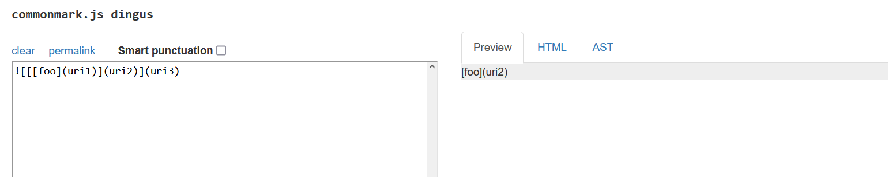
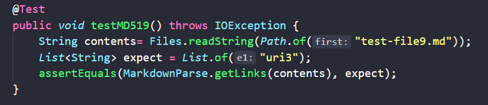
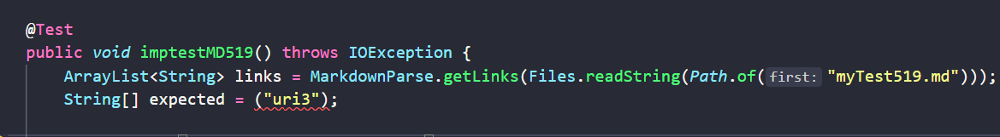
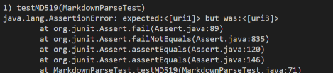
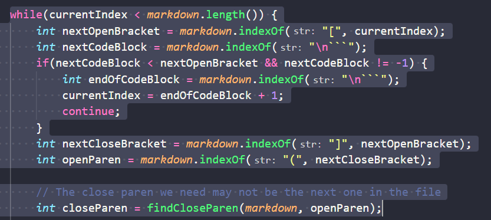
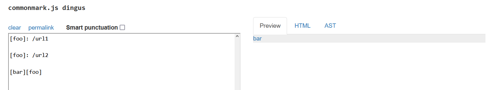
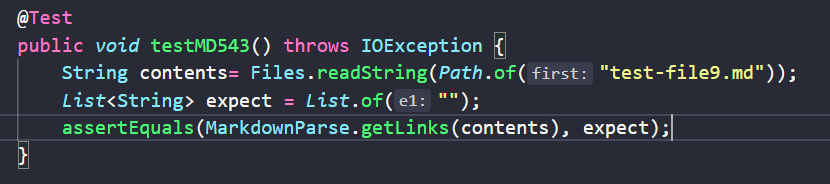
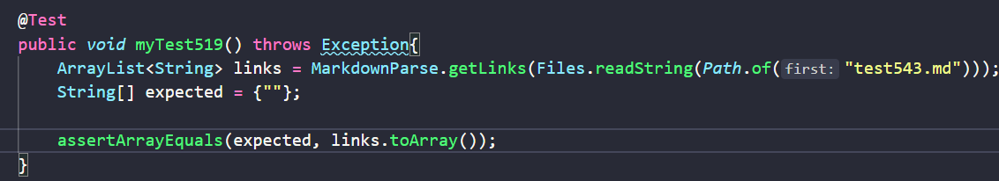
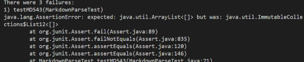
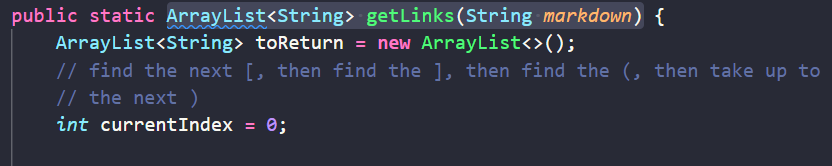

# Lab Report 5 - Week 10
I used the command `diff` on the `test-results` file for `good-markdown-parse` (our group) and `markdown-parser` (Lab 9).  

`diff good-markdown-parser/markdown-parse/results.txt markdown-parser/results.txt > more-results.txt`

This sent the result of `diff` to a text file.

## Links to the test files

[Testfile519](https://github.com/nidhidhamnani/markdown-parser/blob/main/test-files/519.md)
[Testfile543](https://github.com/nidhidhamnani/markdown-parser/blob/main/test-files/543.md)

## Testing 519
Looking at the this test file, `uri3` should be the output, but it is not for either implementation.

 
Here is my Lab 9 test:

Here is my implemented test:

Results:

Issue: 

I believe the code below is not taking the results we want because the first set of parentheses are inside brackets and it is trying to use that instead of the result we are looking for. I believe the code block below would require some changing in how the program reads brackets and parentheses.

## Testing 543
Analyzing this test file a blank result should be the output, but again my implementation and the given `markdown-parser` fails.

Here is my Lab 9 test:

Here is my implemented test:

Results:

Issue:

The problem here is with the variable types that are being passed. So the code block below would need changing along with whatever a change in variable type would cause. This might cascade into other issues, but I am not completely sure how to fix this issue.

